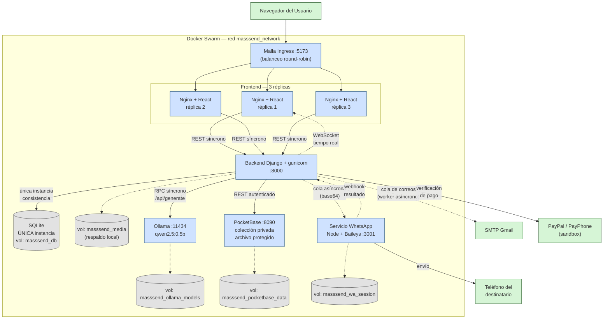

# Prompt para el diagrama COMPLETO de arquitectura (MassSend)

## Recomendación
1. **mermaid.live** (recomendado): pega directo el código Mermaid de la sección "Listo para pegar" más abajo. Se dibuja exacto, sin depender de que una IA interprete bien las cajas.
2. **Claude.ai**: pégale el prompt de texto de abajo y pídele el código Mermaid (no una imagen) — así puedes editarlo tú después.
3. Evita generadores de imágenes (DALL-E, Midjourney, etc.) para este tipo de diagrama: inventan texto y salen ilegibles.

---

## Prompt de texto (para pedirle a una IA que te genere el código)

```
Genera un diagrama de arquitectura en sintaxis Mermaid (flowchart TD) de un
sistema distribuido llamado MassSend, desplegado en un clúster de Docker
Swarm. Debe mostrar TODOS estos elementos:

1. Un nodo "Navegador del Usuario" fuera del clúster.
2. Un contenedor grande (subgraph) llamado "Docker Swarm - masssend_network"
   que engloba todo lo demás.
3. Dentro, un nodo "Malla Ingress :5173 (balanceo round-robin)" que recibe
   al navegador.
4. Ese nodo se conecta a un subgraph "Frontend (3 réplicas)" con tres cajas:
   "Nginx+React réplica 1", "réplica 2", "réplica 3".
5. Las 3 réplicas conectan (flecha sólida, etiqueta "REST síncrono") a un
   nodo único "Backend Django + gunicorn :8000".
6. El Backend conecta a:
   - "Base de Datos SQLite (volumen ÚNICO masssend_db)" con flecha sólida
     etiquetada "única instancia - consistencia".
   - "Ollama :11434 (modelo qwen2.5:0.5b)" con flecha sólida etiquetada
     "RPC síncrono /api/generate".
   - "PocketBase :8090 (colección privada, archivo protegido)" con flecha
     sólida etiquetada "REST autenticado".
   - "Servicio WhatsApp Node+Baileys :3001" con flecha PUNTEADA etiquetada
     "cola asíncrona (mensajes en base64)".
   - "SMTP Gmail" con flecha PUNTEADA etiquetada "cola de correos
     (worker asíncrono)".
   - "PayPal / PayPhone (sandbox)" con flecha sólida etiquetada
     "verificación de pago".
7. El Servicio WhatsApp conecta (flecha sólida) a un nodo externo
   "Teléfono del destinatario" fuera del clúster, y regresa (flecha
   punteada etiquetada "webhook") al Backend.
8. El Backend conecta de vuelta al Frontend con flecha punteada etiquetada
   "WebSocket (tiempo real)".
9. Agrega 5 nodos pequeños tipo cilindro (volúmenes) conectados con línea
   fina a su servicio dueño: masssend_db (Backend), masssend_media
   (Backend), masssend_wa_session (WhatsApp), masssend_ollama_models
   (Ollama), masssend_pocketbase_data (PocketBase).

Usa colores o estilos distintos para: servicios de aplicación (azul),
almacenamiento/volúmenes (gris), servicios externos como PayPal/Gmail/
Teléfono (verde). Agrega al final una leyenda de dos líneas: flecha sólida
= comunicación síncrona, flecha punteada = comunicación asíncrona.
```

---

## Código Mermaid — listo para pegar directo en mermaid.live



**Leyenda:** flecha sólida (`-->`) = comunicación síncrona · flecha punteada (`-.->`) = comunicación asíncrona.

---

## Tip
En mermaid.live, botón **Actions → Export as PNG/SVG** para pegarlo directo en tu informe Word o en las diapositivas.
